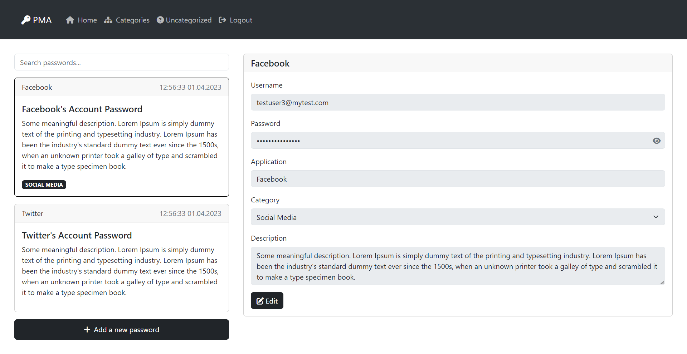

# Password Manager App

- created by: [Pola Eskandar](https://github.com/polaeskandar).
- **Estimated** building time: 3 hours.
- **Estimated** optimizing time: 2 hours.
- **Estimated** documenting time: 1 hours.
- **Estimated** adding new features time: 3 hours.

---

> IMPORTANT: Some parts of this code are definitely not efficient, just there for the sake of time... One possible improvement could be using JWT library instead of manually managing auth tokens. Another possible improvement could be using a DMS (Mongodb, MySQL, PostgreSQL...) instead of using filesystem to store data.

---

